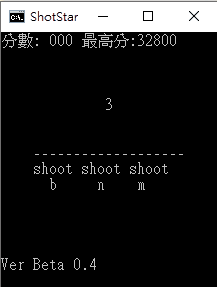

# 以此紀念  2017.04.22 ~ 2017.12.11
# ShotStar 
## 遊戲簡介

星星從上方隨機掉落，玩家用 b（左）、n（中）、m（右）擊中星星得分。按錯螢幕會閃紅並延遲，分數達特定門檻時星星變色並加分。簡單考驗反應的小遊戲！

 **機制介紹**：  
  - 星星★ 從上方隨機出現（左、中、右），逐行向下移動。  
  - 按 `b`（左）、`n`（中）、`m`（右）擊中星星得分（初始 100 分，最高 1000 分）。  
  - 錯過星星螢幕閃紅，分數達門檻（5000、15000、30000、50000）時變色並加分。  

## 如何遊玩

1. **環境**：Windows 系統（支援 CMD）  
2. **啟動**：  
   - 確保 `Bin` 資料夾與`ShotStar3x.bat` 或 `ShotStar4x.bat`  在同一目錄  
   - 雙擊 `ShotStar3x.bat` 或 `ShotStar4x.bat` 執行  
3. **操作**：  
   - 按 `b`、`n`、`m` 擊中星星  
   - 按 `R` 重置，`E` 清除最高分，`Q` 退出  
4. **目標**：挑戰反應速度，爭取高分！  
5. **分數查詢**：執行 `ScoreShow.bat` 查看 3x 和 4x 模式分數（需與 `Bin` 資料夾同目錄），按任意鍵刷新
   
 **製作時間**：
 
 - 草創 2017.04.22 (Beta 0.1)
 - 完整版 2017.12.11
   
## 版本紀錄

- **Beta 0.2**  
  - 增加誤按延遲  
  - 增加時間限制  
  - 增加 `Q` 退出遊戲  
  - 增加誤按畫面效果（螢幕閃紅）  
  - 增加最高分數記錄系統  
  - 增加遊戲內顯示最高分數  
  - 增加遊戲顯示最高輸出量為 6 列  
  - 增加 `R` 重置遊戲  
  - 增加等級顏色、加分系統  
  - 增加 `E` 清除最高紀錄  

- **Beta 0.3**  
  - 完成 `Bin` 資料夾（包含計分與時間控制文件）  

- **Beta 0.4**  
  - 完成 4 行版（調整遊戲顯示高度）  
